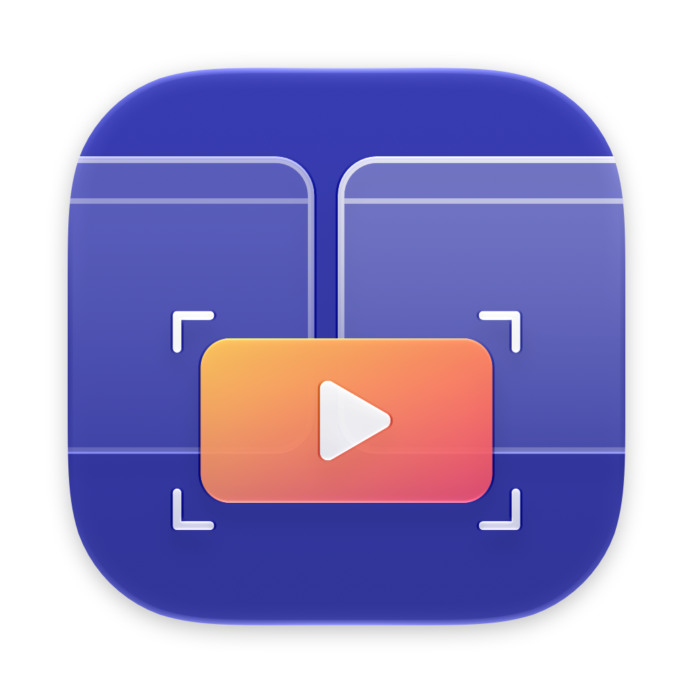
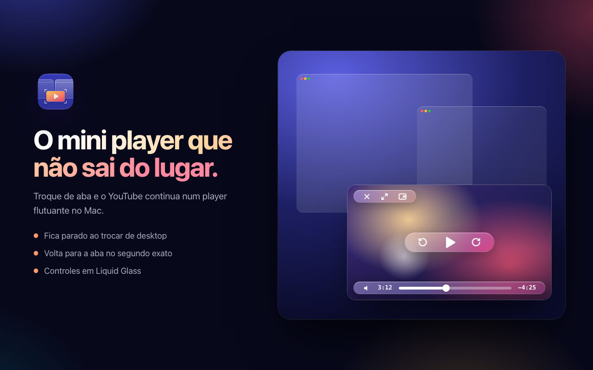

<p align="center"></p>

<h1 align="center">FloatTube</h1>

<p align="center">O mini player do YouTube para Mac que <strong>não sai do lugar quando você troca de desktop</strong>, nem durante a animação.</p>

<p align="center"><a href="https://floattube.vercel.app">Site</a> · <a href="https://github.com/amorimcode/floattube/releases/latest">Download</a> · <a href="https://floattube.vercel.app/privacy">Privacidade</a></p>



## Por que o PiP do Chrome "pula"

O PiP do Chrome é uma janela comum marcada como "em todos os desktops". Uma janela assim continua pertencendo aos desktops, então entra na animação de troca: desliza junto e volta para o lugar no fim.

O FloatTube coloca o player num **Space privado do WindowServer**, que fica acima dos desktops e não participa da animação. Os desktops deslizam por baixo e o player fica parado no mesmo pixel. Apps de "notch" usam a mesma técnica.

## Partes

- `macos/`: app de barra de menus (Swift/AppKit) com o player flutuante e um servidor WebSocket local em `127.0.0.1:38917`.
- `chrome-extension/`: extensão que, ao trocar de aba, pausa o vídeo e o manda para o app no mesmo ponto. Ao voltar para a aba, o vídeo continua de onde o player parou.
- `site/`: landing page, publicada na Vercel.
- `assets/`: ícones. `AppIcon.icon` é o ícone Liquid Glass, feito no formato do Icon Composer.
- `store/`: imagens e textos da Chrome Web Store.

## Instalação

1. Baixe o [`FloatTube.zip`](https://github.com/amorimcode/floattube/releases/latest/download/FloatTube.zip), descompacte e arraste o app para Aplicativos.
2. O app não é notarizado pela Apple. Na primeira abertura, vá em **Ajustes do Sistema → Privacidade e Segurança → Abrir Mesmo Assim**, ou rode:
   ```bash
   xattr -dr com.apple.quarantine /Applications/FloatTube.app
   ```
3. Baixe a [extensão](https://github.com/amorimcode/floattube/releases/latest/download/FloatTube-Chrome-Extension.zip) e descompacte. Em `chrome://extensions`, ative o **Modo do desenvolvedor** e arraste a pasta para a página.
4. Recarregue as abas do YouTube.

## Uso

- **Automático:** com um vídeo tocando, troque de aba e o vídeo vai para o player. Volte para a aba e ele continua lá.
- **Manual:** clique no ícone da extensão ou use `Alt+Shift+P`.
- **Player:** passe o mouse por cima para ver os controles em Liquid Glass (fechar, tamanho, voltar para a aba, ±10 s, play/pause, progresso e som).
  - Clique no vídeo para pausar e arraste de qualquer ponto para mover.
  - Redimensione pelas bordas ou com pinça no trackpad.
  - Atalhos: espaço, ← → e M.
- **Menu do app:** "Abrir link do YouTube copiado" funciona sem a extensão. "Fixar acima dos Spaces" pode ser desligado para comparar com o comportamento padrão.

## Compilar

Precisa do Xcode (macOS 14+).

```bash
./macos/build.sh install    # compila (universal), instala em /Applications e abre
./macos/build.sh release    # gera dist/FloatTube.zip e dist/FloatTube-Chrome-Extension.zip
./scripts/make-icons.sh     # regera os ícones a partir de assets/
./store/render.sh           # regera as imagens da loja e do site
```

## Observações

- O Space privado usa APIs privadas do macOS (SkyLight). Se uma versão futura removê-las, o app detecta e volta ao modo padrão.
- O player é o incorporado do YouTube, com os controles do YouTube escondidos. Se o dono do vídeo bloqueou a incorporação, o app abre a página do YouTube mostrando só o vídeo.
- O player não usa o login do navegador, então anúncios podem aparecer mesmo com YouTube Premium. Durante anúncios, os cliques passam direto para o YouTube, para dar para clicar em "Pular anúncio".
- Não é afiliado ao YouTube nem ao Google.
